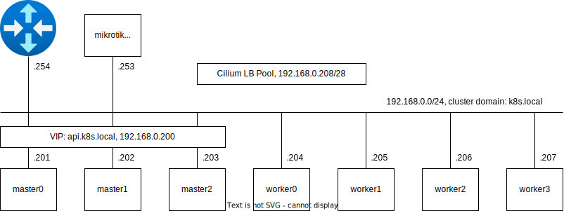

# Talos Home Cluster

The following guide shows the steps to install talos k8s on my home lab. The setup described below
contains 3 master nodes and 4 worker nodes based on HP EliteDesk 800 G4 SFF PCs.

As a CNI I decided to use cilium. After the initial configuration I use ArgoCD to manage the
configuration on the cluster. The ArgoCD repository is located separately on GitHub.

It is customized for my home environment and needs to get adjusted slightly when used in another
environment.

The guide assumes you run the installation on a mac.

If not, certain commands will not work (cilium cli installation and olm installation). Alternatives
can be found on the internet.

## Cluster Diagram

The following diagram gives a brief overview about the set up home lab cluster.



## Prerequisites

The following prerequisites must be met before starting.

1. Reserve DNS entry for each node and for the api. In my case the dns entries are as following:
  - api.k8s.local => 192.168.0.200
  - master0.k8s.local => 192.168.0.201
  - master1.k8s.local => 192.168.0.202
  - master2.k8s.local => 192.168.0.203
  - worker0.k8s.local => 192.168.0.204
  - worker1.k8s.local => 192.168.0.205
  - worker2.k8s.local => 192.168.0.206
  - worker3.k8s.local => 192.168.0.207

2. For easier management during initial boot, make a dhcp reservation for each node with the IP
address and its MAC address.

2. Download Talos from the releases GitHub page
([github.com/siderolabs/talos/releases](https://github.com/siderolabs/talos/releases/)) and flash
the iso to a memory stick with a tool like balenaEtcher.

3. Boot all nodes from the memory stick.

## Talos base installation

Make sure the defined values under `talos/nodes/*.yaml` `talos/patches/*.yaml` are correct. Especially the disks and
network interfaces need to be checked.

Define general variables:

```bash
export CLUSTER_NAME=k8s.local
export API_ENDPOINT=https://api.${CLUSTER_NAME}:6443
```

Generate secret information (ssl keys and certs) and the generic talos configuration:

```bash
talosctl gen secrets --output-file secrets.yaml
talosctl gen config  \
    --with-secrets secrets.yaml \
    --output-types talosconfig  \
    --output talosconfig        \
    $CLUSTER_NAME               \
    $API_ENDPOINT
talosctl config merge ./talosconfig
```

Generate the master node configuration for each master node:

```bash
export NODE_TYPE=master
for i in {0..2}
do
  talosctl gen config \
    --output rendered/${NODE_TYPE}${i}.yaml     \
    --output-types controlplane                 \
    --with-cluster-discovery=false              \
    --with-secrets secrets.yaml                 \
    --config-patch @patches/cluster-name.yaml   \
    --config-patch @patches/cni.yaml            \
    --config-patch @patches/disk.yaml           \
    --config-patch @patches/vip.yaml            \
    --config-patch @nodes/${NODE_TYPE}${i}.yaml \
    $CLUSTER_NAME                               \
    $API_ENDPOINT
done
```

Generate the worker node configuration for each worker node:

```bash
export NODE_TYPE=worker
for i in {0..3}
do
  talosctl gen config \
    --output rendered/${NODE_TYPE}${i}.yaml     \
    --output-types worker                       \
    --with-cluster-discovery=false              \
    --with-secrets secrets.yaml                 \
    --config-patch @patches/cluster-name.yaml   \
    --config-patch @patches/cni.yaml            \
    --config-patch @patches/disk.yaml           \
    --config-patch @nodes/${NODE_TYPE}${i}.yaml \
    $CLUSTER_NAME                               \
    $API_ENDPOINT
done
```

Apply the master node configuration to the master nodes:

```bash
export NODE_TYPE=master
for i in {0..2}
do
  talosctl --nodes ${NODE_TYPE}${i}.${CLUSTER_NAME} apply-config --file rendered/${NODE_TYPE}${i}.yaml --insecure
done
```

Apply the worker node configuration to the master nodes:

```bash
export NODE_TYPE=worker
for i in {0..3}
do
  talosctl --nodes ${NODE_TYPE}${i}.${CLUSTER_NAME} apply-config --file rendered/${NODE_TYPE}${i}.yaml --insecure
done
```

Bootstrap the talos cluster:

```bash
talosctl bootstrap \
  --nodes master0.${CLUSTER_NAME} \
  --endpoints master0.${CLUSTER_NAME} \
  --talosconfig=./talosconfig
```

Finally retreive the kube config

```bash
talosctl kubeconfig \
  --nodes master0.${CLUSTER_NAME} \
  --endpoints master0.${CLUSTER_NAME} \
  --talosconfig=./talosconfig
```

The nodes should be visible now, but in `NotReady` state:

```bash
% kubectl get nodes
NAME      STATUS     ROLES           AGE     VERSION
master0   NotReady   control-plane   3m41s   v1.32.3
master1   NotReady   control-plane   3m13s   v1.32.3
master2   NotReady   control-plane   3m42s   v1.32.3
worker0   NotReady   <none>          3m54s   v1.32.3
worker1   NotReady   <none>          3m54s   v1.32.3
worker2   NotReady   <none>          3m53s   v1.32.3
worker3   NotReady   <none>          3m53s   v1.32.3
```

## Cilium installation

Before the cilium installation the cluster is not ready to be used. So let's go through the setup.

Get the latest stable cilium CLI version and download/install it:

```bash
CILIUM_CLI_VERSION=$(curl -s https://raw.githubusercontent.com/cilium/cilium-cli/main/stable.txt)
CLI_ARCH=amd64
if [ "$(uname -m)" = "arm64" ]; then CLI_ARCH=arm64; fi
curl -L --fail --remote-name-all https://github.com/cilium/cilium-cli/releases/download/${CILIUM_CLI_VERSION}/cilium-darwin-${CLI_ARCH}.tar.gz{,.sha256sum}
shasum -a 256 -c cilium-darwin-${CLI_ARCH}.tar.gz.sha256sum
sudo tar xzvfC cilium-darwin-${CLI_ARCH}.tar.gz /usr/local/bin
rm cilium-darwin-${CLI_ARCH}.tar.gz{,.sha256sum}
```

Install cilium Helm chart on the cluster:

```bash
helm repo add cilium https://helm.cilium.io/

CILIUM_VERSION=$(curl -s https://raw.githubusercontent.com/cilium/cilium/main/stable.txt)
helm upgrade -i cilium cilium/cilium --version ${CILIUM_VERSION} \
  --namespace kube-system \
  --set ipam.mode=kubernetes \
  --set=kubeProxyReplacement=true \
  --set=securityContext.capabilities.ciliumAgent="{CHOWN,KILL,NET_ADMIN,NET_RAW,IPC_LOCK,SYS_ADMIN,SYS_RESOURCE,DAC_OVERRIDE,FOWNER,SETGID,SETUID}" \
  --set=securityContext.capabilities.cleanCiliumState="{NET_ADMIN,SYS_ADMIN,SYS_RESOURCE}" \
  --set=cgroup.autoMount.enabled=false \
  --set=cgroup.hostRoot=/sys/fs/cgroup \
  --set=k8sServiceHost=localhost \
  --set=k8sServicePort=7445 \
  --set ingressController.enabled=true \
  --set ingressController.default=true \
  --set l2announcements.enabled=true \
  --set externalIPs.enabled=true \
  --set devices=eno1 \
  --set k8sClientRateLimit.qps=32 \
  --set k8sClientRateLimit.burst=48 \
  --set hubble.relay.enabled=true \
  --set hubble.ui.enabled=true
```

Validate the installation:

```bash
kubectl get pods --all-namespaces -o custom-columns=NAMESPACE:.metadata.namespace,NAME:.metadata.name,HOSTNETWORK:.spec.hostNetwork --no-headers=true | grep '<none>' | awk '{print "-n "$1" "$2}' | xargs -L 1 -r kubectl delete pod

cilium status --wait
```

### Cilium LoadBalancer IP Pool

```bash
cat <<EOF | kubectl apply -f -
---
apiVersion: "cilium.io/v2alpha1"
kind: CiliumLoadBalancerIPPool
metadata:
  name: lb-pool-01
spec:
  blocks:
  - cidr: 192.168.0.208/28
EOF

# Validation

kubectl get ciliumloadbalancerippool.cilium.io

cat <<EOF | kubectl apply -f -
apiVersion: v1
kind: Service
metadata:
  name: service-red
  namespace: default
spec:
  type: LoadBalancer
  ports:
  - port: 1234
EOF

kubectl delete svc service-red

```

### Cilium L2 Announcement Policy

```bash
cat <<EOF | kubectl apply -f -
apiVersion: "cilium.io/v2alpha1"
kind: CiliumL2AnnouncementPolicy
metadata:
  name: basic-policy
spec:
  interfaces:
  - eno1
  externalIPs: true
  loadBalancerIPs: true
EOF

# Validation

kubectl get ciliuml2announcementPolicy.cilium.io

```

### Cilium Doc how to set a single IP for the default-ingress

https://mkz.me/weblog/posts/cilium-enable-ingress-controller/


## OLM Installation

```bash
brew install operator-sdk
operator-sdk olm install

# Validation
kubectl get ns
kubectl get pods -n olm
```

## ArgoCD installation

```bash
kubectl create namespace argocd

git clone https://github.com/argoproj-labs/argocd-operator.git
cd argocd-operator

# Install Operator Catalog
kubectl create -n olm -f deploy/catalog_source.yaml

# Validation
kubectl get catalogsources -n olm
kubectl get pods -n olm -l olm.catalogSource=argocd-catalog

# Install Operator Group
kubectl create -n argocd -f deploy/operator_group.yaml

# Validation
kubectl get operatorgroups -n argocd

# Install Subscription
kubectl create -n argocd -f deploy/subscription.yaml

# Validation
kubectl get subscriptions -n argocd
kubectl get installplans -n argocd
kubectl get pods -n argocd

cat <<EOF | kubectl apply -f -
apiVersion: argoproj.io/v1beta1
kind: ArgoCD
metadata:
  name: argocd
  namespace: argocd
spec:
  server:
    host: argocd.k8s.local
    service:
      type: LoadBalancer
EOF

kubectl -n argocd get secret argocd-cluster -o jsonpath="{.data.admin\.password}" | base64 -d

```

# Talos Linux Upgrade

```bash
export CLUSTER_NAME=k8s.local
export API_ENDPOINT=https://api.${CLUSTER_NAME}:6443
export TALOS_VERSION=v1.9.0   # changeme
```

Upgrade node by node:

```bash
talosctl upgrade --nodes master0.${CLUSTER_NAME} --endpoints master0.${CLUSTER_NAME} --image ghcr.io/siderolabs/installer:$TALOS_VERSION

talosctl upgrade --nodes master1.${CLUSTER_NAME} --endpoints master1.${CLUSTER_NAME} --image ghcr.io/siderolabs/installer:$TALOS_VERSION

talosctl upgrade --nodes master2.${CLUSTER_NAME} --endpoints master2.${CLUSTER_NAME} --image ghcr.io/siderolabs/installer:$TALOS_VERSION

kubectl drain worker0 --ignore-daemonsets
talosctl upgrade --nodes worker0.${CLUSTER_NAME} --endpoints master0.${CLUSTER_NAME} --image ghcr.io/siderolabs/installer:$TALOS_VERSION
kubectl uncordon worker0

kubectl drain worker1 --ignore-daemonsets
talosctl upgrade --nodes worker1.${CLUSTER_NAME} --endpoints master0.${CLUSTER_NAME} --image ghcr.io/siderolabs/installer:$TALOS_VERSION
kubectl uncordon worker1

kubectl drain worker2 --ignore-daemonsets
talosctl upgrade --nodes worker2.${CLUSTER_NAME} --endpoints master0.${CLUSTER_NAME} --image ghcr.io/siderolabs/installer:$TALOS_VERSION
kubectl uncordon worker2

kubectl drain worker3 --ignore-daemonsets
talosctl upgrade --nodes worker3.${CLUSTER_NAME} --endpoints master0.${CLUSTER_NAME} --image ghcr.io/siderolabs/installer:$TALOS_VERSION
kubectl uncordon worker3

brew upgrade talosctl
```

# Kubernetes Upgrade

```bash
talosctl upgrade-k8s --nodes master0.${CLUSTER_NAME} --endpoints master0.${CLUSTER_NAME}
```

# Cilium Upgrade

```bash
helm repo update cilium

CILIUM_VERSION=$(curl -s https://raw.githubusercontent.com/cilium/cilium/main/stable.txt)
helm upgrade cilium cilium/cilium --version ${CILIUM_VERSION} \
  --namespace kube-system \
  --set ipam.mode=kubernetes \
  --set=kubeProxyReplacement=true \
  --set=securityContext.capabilities.ciliumAgent="{CHOWN,KILL,NET_ADMIN,NET_RAW,IPC_LOCK,SYS_ADMIN,SYS_RESOURCE,DAC_OVERRIDE,FOWNER,SETGID,SETUID}" \
  --set=securityContext.capabilities.cleanCiliumState="{NET_ADMIN,SYS_ADMIN,SYS_RESOURCE}" \
  --set=cgroup.autoMount.enabled=false \
  --set=cgroup.hostRoot=/sys/fs/cgroup \
  --set=k8sServiceHost=localhost \
  --set=k8sServicePort=7445 \
  --set ingressController.enabled=true \
  --set ingressController.default=true \
  --set l2announcements.enabled=true \
  --set externalIPs.enabled=true \
  --set devices=eno1 \
  --set k8sClientRateLimit.qps=32 \
  --set k8sClientRateLimit.burst=48 \
  --set hubble.relay.enabled=true \
  --set hubble.ui.enabled=true

cilium status --wait
```

# Get the kubeconfig via talosctl

Define general variables:

```bash
export CLUSTER_NAME=k8s.local
export API_ENDPOINT=https://api.${CLUSTER_NAME}:6443
```

Retreive the kubeconfig

```bash
talosctl kubeconfig \
  --nodes master0.${CLUSTER_NAME} \
  --endpoints master0.${CLUSTER_NAME} \
  --talosconfig=./talosconfig
```

[back to main README.md](../README.md)
